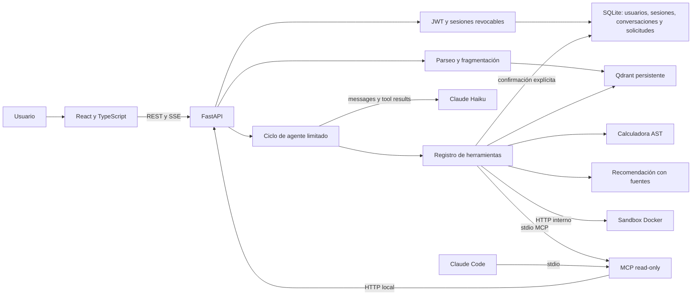

# Arquitectura

El navegador solo consume FastAPI. La API posee configuración, ingesta, recuperación
y orquestación. El registro de herramientas se comparte entre el agente y la vista
de herramientas, para que la demostración pruebe el mismo comportamiento.

Cada consulta recupera evidencia y limita turnos, tokens y llamadas. Las herramientas
devuelven resultados estructurados y se registran con duración y estado. Los eventos
SSE permiten mostrar avances sin inventar cadenas de razonamiento. Los errores del
proveedor se informan sin exponer claves ni mensajes internos sensibles.
Un límite global compartido por REST y SSE evita iniciar más llamadas de modelo
que las permitidas. El trabajo síncrono de autenticación y recuperación se ejecuta
fuera del event loop. La ingesta mantiene su exclusión hasta terminar el trabajo
real, incluso si el cliente cancela la subida.

Qdrant local guarda vectores y SQLite conserva documentos y fragmentos bajo DATA_DIR.
Otra base relacional persistente, `application.sqlite3`, guarda cuentas, sesiones,
conversaciones, mensajes y solicitudes. La configuración de Anthropic procede
exclusivamente del entorno privado del backend; ninguna ruta HTTP acepta claves.
JWT usa claves persistentes privadas, Argon2 protege contraseñas y el refresh está
en una cookie HttpOnly. Logout revoca la familia de sesiones rotadas.
El servidor obtiene el historial por usuario; descarta el historial enviado por el cliente.
La API funciona con un único worker;
un servidor Qdrant externo permite cambiar esa restricción. La selección del embedding
define un espacio vectorial: no mezclar modelos en una colección ya poblada.

El servidor MCP consulta la identidad pública por HTTP y no abre otro escritor
sobre Qdrant. La búsqueda de documentos requiere ahora autenticación; el MCP
sin sesión no accede a ese endpoint protegido. No recibe claves del proveedor.

El sandbox acepta nombres de comandos definidos. Ejecuta argumentos fijos sin shell,
con límites de tiempo, salida y recursos. Solo ese servicio ejecuta procesos de
terminal para el producto; el host de la API no ejecuta instrucciones del modelo.
Compose no publica su puerto y no le entrega credenciales o el socket Docker.

Esta base incluye acceso multiusuario con roles administrador y cliente. Cuotas por
tenant, despliegue público, OCR, navegador autónomo y ejecución arbitraria de código
requieren trabajo específico según el enunciado; no se presentan como capacidades
ya implementadas.
