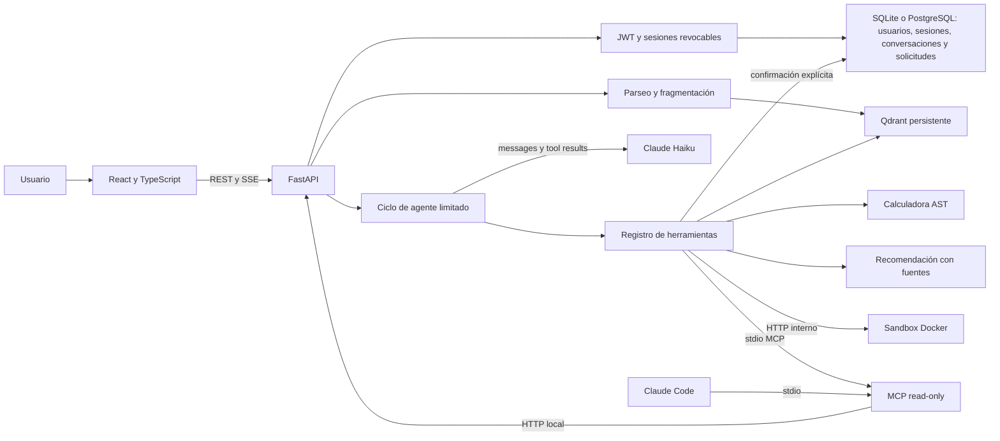

# Arquitectura



El navegador solo consume FastAPI. La API posee configuración, ingesta, recuperación
y orquestación. El registro de herramientas se comparte entre el agente y la vista
de herramientas, para que la demostración pruebe el mismo comportamiento.
Las definiciones de herramientas centralizan catálogo y esquemas de entrada;
`/api/tools` publica esos esquemas para formularios tipados. Una herramienta nueva
requiere registrar su ejecutor permitido, pero sus campos simples ya pueden aparecer
sin añadir otro selector por nombre en el frontend. Los handlers del sandbox siguen
siendo una allowlist independiente: publicar un esquema no autoriza ejecutar shell.

Cada consulta recupera evidencia y limita turnos, tokens y llamadas. Las herramientas
devuelven resultados estructurados y se registran con duración y estado. Los eventos
SSE permiten mostrar avances sin inventar cadenas de razonamiento. Los errores del
proveedor se informan sin exponer claves ni mensajes internos sensibles.
Si faltan citas válidas, el texto libre del modelo se sustituye por incertidumbre
o por una representación determinista del resultado pertinente de la herramienta.
Una calculadora exitosa no valida afirmaciones sobre la empresa. Las citas y la
similitud permiten inspeccionar evidencia; no garantizan por sí solas su implicación
semántica, que debe comprobarse con los casos de aceptación del brief.
Un límite global compartido por REST y SSE evita iniciar más llamadas de modelo
que las permitidas. El trabajo síncrono de autenticación y recuperación se ejecuta
fuera del event loop. La ingesta mantiene su exclusión hasta terminar el trabajo
real, incluso si el cliente cancela la subida.

Qdrant local guarda vectores y SQLite conserva documentos y fragmentos bajo DATA_DIR.
Otra base relacional persistente, `application.sqlite3`, guarda cuentas, sesiones,
conversaciones, mensajes y solicitudes. La configuración de Anthropic procede
exclusivamente del entorno privado del backend; ninguna ruta HTTP acepta claves.
En producción, `DATABASE_URL` selecciona PostgreSQL para esos datos, con transacciones
y un schema dedicado. SQLite sigue siendo la opción local sin red. El volumen de
Qdrant y los archivos de conocimiento permanece en el backend Docker.
JWT usa claves persistentes privadas, Argon2 protege contraseñas y el refresh está
en una cookie HttpOnly. Logout revoca la familia de sesiones rotadas.
El servidor obtiene el historial por usuario; descarta el historial enviado por el cliente.
La API se despliega con un único worker. Un servidor Qdrant externo evita el lock de
su driver local, pero una instalación multiproceso necesita verificar también la
concurrencia de los metadatos y la ingesta. La selección del embedding
define un espacio vectorial: no mezclar modelos en una colección ya poblada.

El servidor MCP consulta la identidad pública por HTTP y no abre otro escritor
sobre Qdrant. La búsqueda de documentos requiere una sesión autenticada: su CLI
de login guarda tokens en un archivo privado ligado al origen, con renovación
acotada. Un JWT explícito puede proporcionarse en el entorno del proceso MCP.
Los errores temporales conservan la sesión; los rechazos de autenticación se
informan de forma diferenciada. No recibe claves del proveedor.

La identidad, el enlace, las preguntas sugeridas y el catálogo de productos son
configurables. Humanizar permanece como ejemplo de Softop; otro nombre no hereda
productos o enlaces de esa empresa. Las recomendaciones siguen exigiendo evidencia
documental aunque un producto figure en la configuración.

El sandbox acepta nombres de comandos definidos. Ejecuta argumentos fijos sin shell,
con límites de tiempo, salida y recursos. Solo ese servicio ejecuta procesos de
terminal para el producto; el host de la API no ejecuta instrucciones del modelo.
Compose no publica su puerto y no le entrega credenciales o el socket Docker.

Vercel sirve la aplicación React y reenvía `/api` al origen HTTPS. Un header privado
del proxy identifica esas peticiones; el origen rechaza acceso directo sin él.
La cookie de refresh y el JWT se mantienen bajo el origen de la web. El proxy
evita almacenar respuestas privadas en caché y el backend mantiene el presupuesto
de ejecución durante toda la respuesta SSE. Ver docs/DEPLOYMENT.md.

Esta base incluye acceso multiusuario con roles administrador y cliente. Cuotas por
tenant, OCR, navegador autónomo y ejecución arbitraria de código
requieren trabajo específico según el enunciado; no se presentan como capacidades
ya implementadas.

## Estructura del código

```text
backend/app/
├── main.py            fábrica FastAPI: recursos, middleware y routers
├── manage.py          CLI de operación (create-admin, mcp-login)
├── core/              settings, redacción de secretos, límites de petición
├── api/               schemas, dependencies, errors y routes/ (un router por recurso)
├── agent/             company_agent (bucle), provider, prompt, grounding, fallback, demo
├── tools/             definitions (contrato), registry (validación/redacción/tiempos),
│   └── handlers/      un handler por herramienta, agrupados por dominio, en HANDLERS
├── knowledge/         ingesta, PDF, embeddings, store Qdrant y corpus inicial
├── accounts/          passwords, tokens, rate_limit, schemas, dependencies, router
├── persistence/       contracts, models, factory, signing
│   ├── sqlite/        cuentas, sesiones y conversaciones
│   └── postgres/      conexión, schema, cuentas, sesiones, conversaciones y solicitudes
├── business/          perfil de empresa y solicitudes de demo/soporte
└── mcp/               server, client, sessions y errores
backend/tests/         mismas carpetas por dominio + regressions/

frontend/src/
├── main.tsx           entrada
├── app/               App (composición), layout/ (sidebar, topbar, ayuda), hooks/
├── features/          auth, chat (hook useChat y componentes), customers, docs (secciones),
│                      documents, requests, tools
├── shared/            api (cliente, auth, SSE, validation/ por dominio, tipos), config, hooks, ui
└── styles/            global.css importa en orden los parciales por área

scripts/               CLIs finos; material_import/ (importador del ZIP) y deploy_tests/
```

Los módulos se mantienen por debajo de ~250 líneas con una responsabilidad cada uno.

Una capacidad nueva se ubica en su dominio: el contrato HTTP en `api/schemas.py`, la ruta
en `api/routes/<recurso>.py`, la lógica en su paquete y la vista en `features/<dominio>`.
